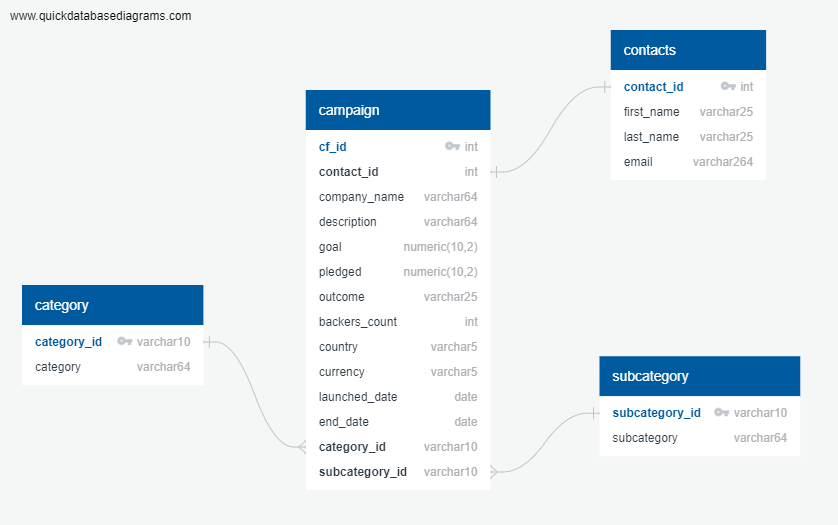

# Crowdfunding_etl

This repository is for the Project 2 crowdfunding ETL (Extract, Transform and Load) challenge. 

## Part 1:  ETL project

In this stage of the project, we imported the 'crowdfunding.xslx' and 'contacts.xslx' files for data extraction, processing, and cleansing. The goal was to transform the data into a format compatible with CSV for seamless loading into pgAdmin.

To achieve this, we utilized a Jupyter notebook named 'ETL_Mini_Project_SHussain_HRehman_RBarker.ipynb'. The notebook executed various data processing tasks including regular expressions to generated four distinct CSV files, namely: 'campaign.csv', 'contacts.csv', 'category.csv', and 'subcategory.csv'. These files contain the refined and structured data, ready for further analysis and database integration within the pgAdmin environment.

## Part 2: ERD and PGAdmin

During the project, we employed QuickDBD to create an Entity-Relationship Diagram (ERD) for the database, the resulting PNG file of the generated ERD is included below for reference.

To facilitate database setup, we saved the schema for the four entities in the 'crowdfunding_db_schema.sql' file. Subsequently, we imported the data from the four CSV files into their respective tables. To ensure the accuracy of the import process, we verified the correctness of the data insertion using the SELECT * FROM commands within the database environment.

## Reference

QuickDBD: https://www.quickdatabasediagrams.com/

